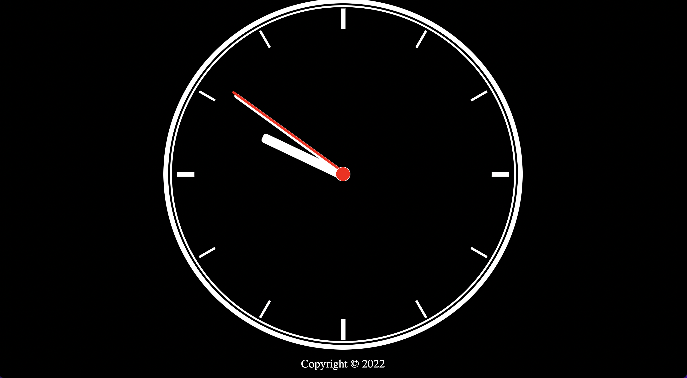

# analog-clock

## Overview

### The challenge

Users should be able to:

- View the optimal layout for the component depending on their device's screen size
- See hover states for all interactive elements on the page
- See current time with a analog clock

### Screenshot

### Links

- Live Site URL: https://yusuf-demirci.github.io/analog-clock/

### Built with

- Semantic HTML5 markup
- CSS custom properties
- Flexbox
- Mobile-first workflow
